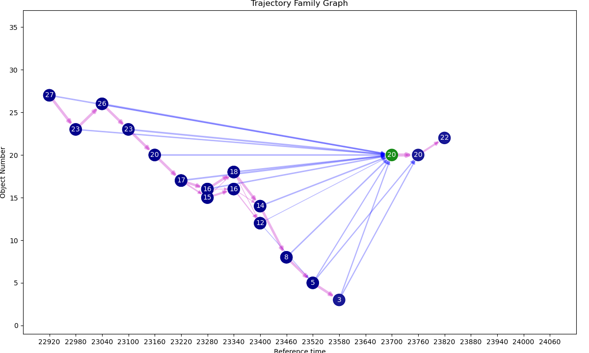
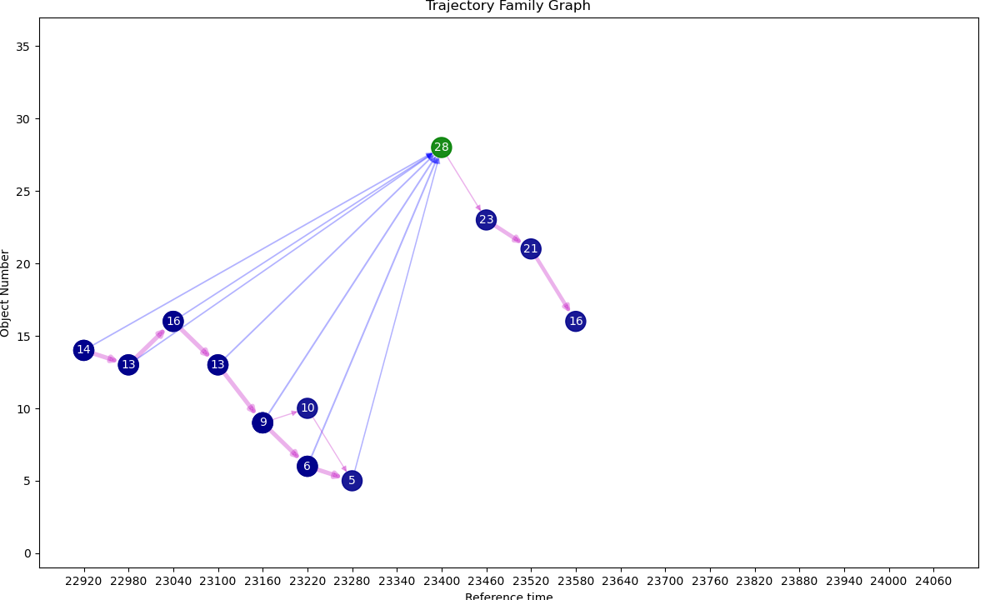
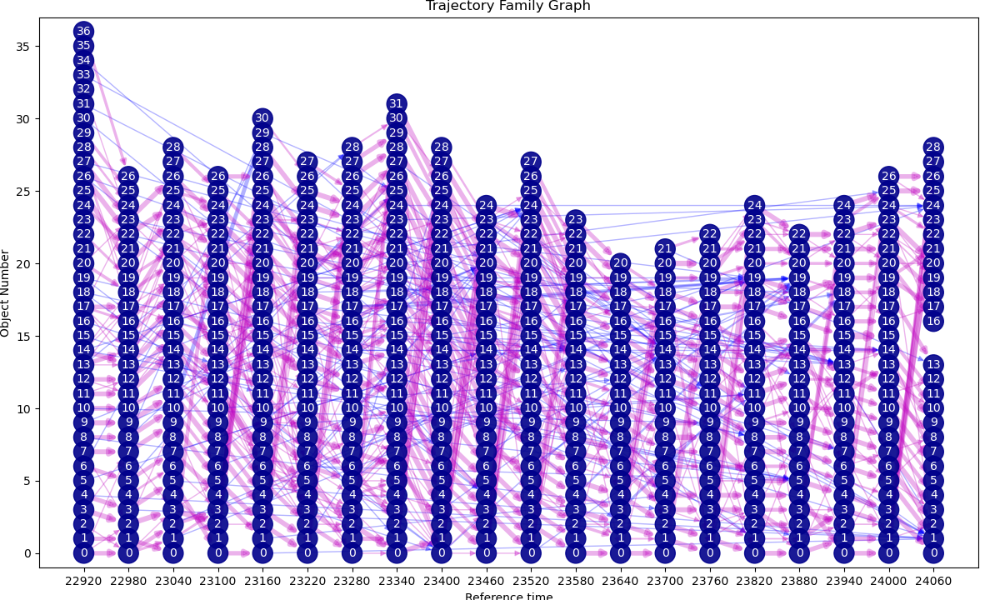
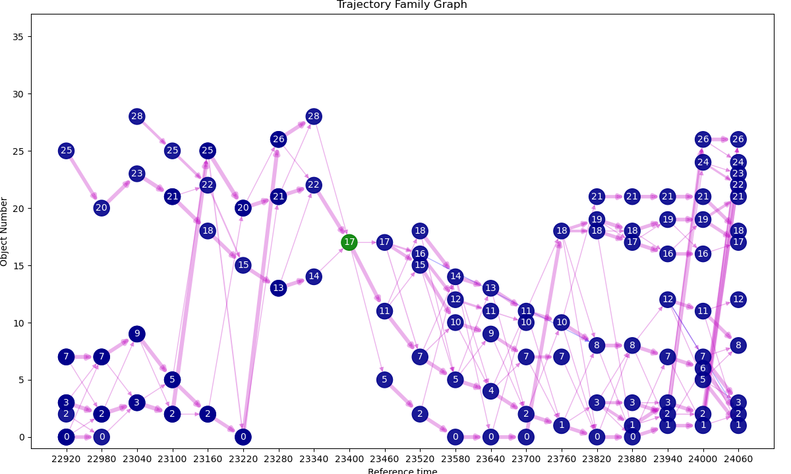
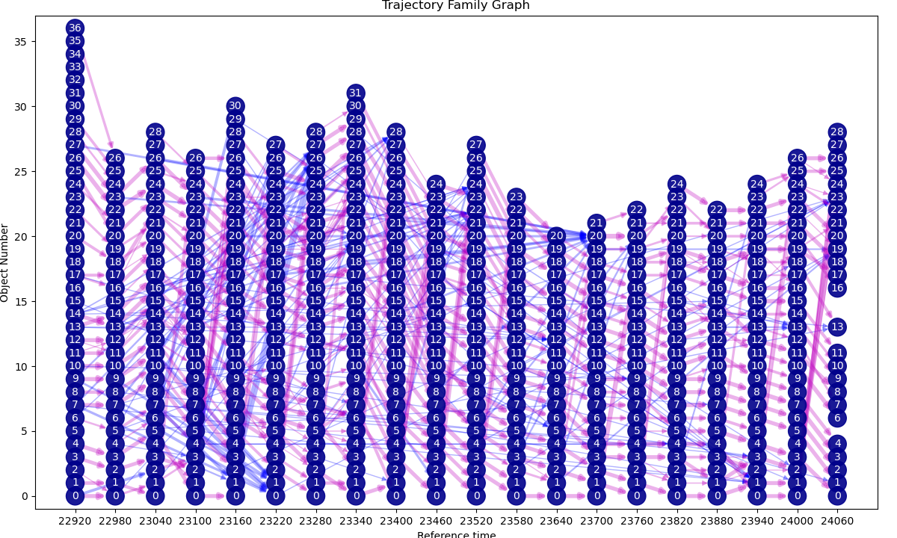
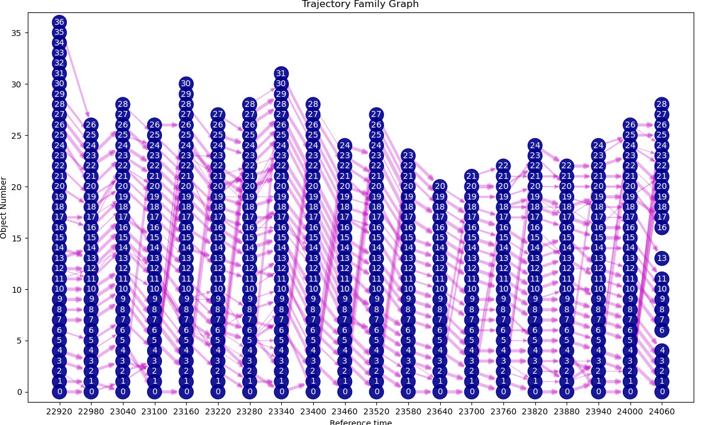
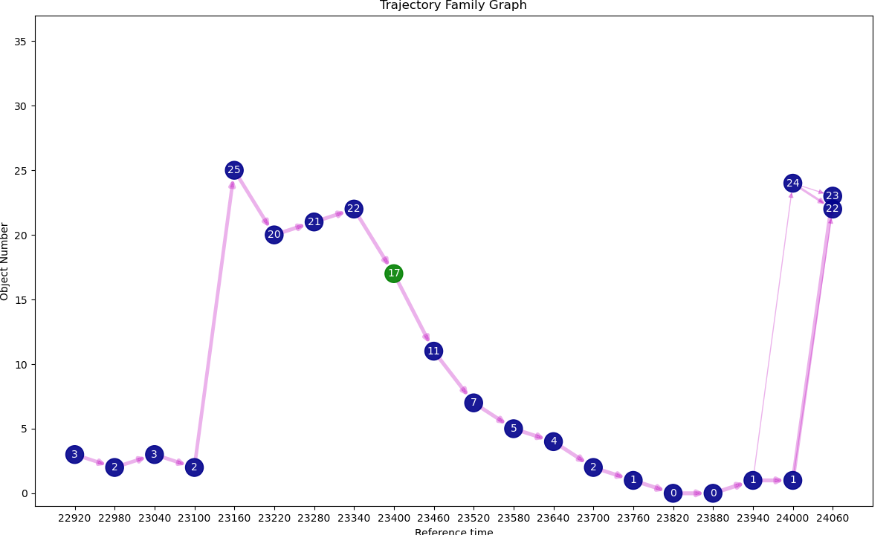
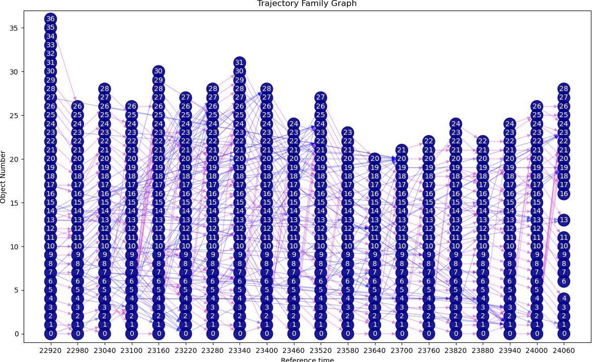

# Notes on this branch.

## New in this commit.
- Added some functionality to generate graphs of related objects; see [Graphs of related objects](#graphs-of-related-objects).

- Simplified `plot.plot_trajectory_animation.plot_family_animation` to not depend on or use matching object dictionaries; it now accepts a list of objects in the form (time:float, object_number:int) to selct objects in the family to plot.

- Added some options to `family.traj_family.find_family_matching_objects`.

##  Introduction

This branch contains the following, related, subpackages:
- `plot`
- `classify`
- `family`

The first of these provides some matplotlib-based (i.e. slow) functionality for 3D plotting of trajectories.
We shall use it to illustrate the other two.

## The plot subpackage

The module `plot.plot_trajectory_animation.py` contains two main functions.
The function `plot_traj_animation` is used to plot trajectories from one reference time.
At its most basic, it animates all of the objects in the input xarray (identified by `object_label`).
Here is an example from a MONC simulation of BOMEX, showing each object as a different colour:

Optionally, a galilean transform can be applied to move the plot with the mean wind:

Individual objects can be selected, and just a sub-domain plotted.
If the trajectory dataset contains the variable `obj_mask` then points with `obj_mask==True` can be distinguished
with different sized dots.
For example, here the mask was set up using `q_cloud_liquid_mass > 1E-5`.
Here is object 9:

Sometimes it is useful to compare the Lagrangian view, trajectories with origin at a given time, in cloud, say)
with the Eulerian view, grid points in cloud at different times.
This can be done by supplying a `field_mask` derived from the original gridded data.
For example, here is the same figure as above with the Eulerian cloud field as black dots.

## The classify subpackage

The classify/traj_classify module can be used to classify points along a trajectory using a combination of masks.
For example, the same mask as used above may identify points with or without cloud water (or, strictly, exceeding a non-zero threshold).
The function `classify.traj_classify.set_traj_class` provides the basic functionality.
It recognises that trajectories can go in and out of, say, cloud, multiple times.
Thus, this function starts at the trajectory reference time and moves both back in forward, identifying points that are 'in' or 'not in' the mask.
It also counts how many times the trajectory has been 'in' the mask.
So points at the reference time 'in' the mask are labelled '(In,0)' and those not in '(Pre,0)'.
Stepping backwards in time, the code looks for changes in status (i.e. 'in-mask' to 'not in-mask', and *vice versa*) and changes the label appropriately, so if a trajectory starts 'in-mask', going backwards in time it may change to `(Pre,0)`, `(In, -1)`, `(Pre, -1)`, `(In, -2)`, `(Pre, -2)` etc., so that 'in-mask' events before the one at the reference time are labelled with negative numbers.
The same process applies going forwards, so status changes to `(Post, 0)`, `(In, 1)`, `(Post, 1)` etc..
These are coded in integer data matching the trajectory data, and returned in a dictionary with item 'class'; the same dictionary provides a mapping of these integers to the tuples above in item 'key'.
Note that this system works most clearly where all the points at the reference time are 'in-mask'.
This is illustrated for the same object as above:

Masks can easily be combined using `classify.traj_classify.combine_traj_classes`; currently this only implements
a logical and between masks, so that the labels can simply be added as strings.
An example is given in examples cloud_classify.py in which the 'in-cloud' mask above is combined with 'in-BL', i.e. in the boundary-layer, defined as height less than cloud-base, evaluated as the minimum height of 'in-cloud' trajectory points.
This module also implements a simple function to re-label the combined mask, leading to a classification illustrated below, where, before entering cloud air is classified as pre-entrainment, either from the BL or not, and, likewise, after leaving cloud, air is Post-detrainment, and the possibility of multiple cloud encounters is retained.

The multiple cloud encounters can be put into context by including the Eulerian cloud field:
 

 ## The family subpackage

 Unless otherwise stated, all the functions in this section are in the module `family.traj_family`.

 So far the trajectory code has dealt with forward and back trajectories started at a given reference time.
 Of course, and data time in the source data can be used as a reference time, and we define the set of trajectories from a contiuous range of reference times as a **family** of trajectories.
 If these start from selected objects, there is likely to be a different number of trajectories (and objects) at each reference time, which makes it difficult to combine the familt into one dataset.
 At present, we have adopted the simple solution of generating a separate NetCDF file for each reference time, using an numerical sequence number to the file name.

 The task of generating a family is met by `traj_family`.
 This takes an xarray Dataset.
 This is as per the trajectory integration functions and can be generated using `xarray.open_mfdataset` to concatenate multiple files.
 See 'examples\/load_data.py' for an example.

 Given a list of paths it is not obvious what data are available.
 A trajectory family can be analysed using `analyse_traj_family`.
 The output from this can be summarised by passing it to `summarise_traj_family`; an example output is:

    21060.0: ***********************************xxxxxxxxxxxxxxxxxxxxxxxxxxxxxxxxx
    21120.0: R***********************************xxxxxxxxxxxxxxxxxxxxxxxxxxxxxxxx
    21180.0: *R***********************************xxxxxxxxxxxxxxxxxxxxxxxxxxxxxxx
    21240.0: **R***********************************xxxxxxxxxxxxxxxxxxxxxxxxxxxxxx
    21300.0: ***R***********************************xxxxxxxxxxxxxxxxxxxxxxxxxxxxx
    21360.0: ****R***********************************xxxxxxxxxxxxxxxxxxxxxxxxxxxx
    21420.0: *****R***********************************xxxxxxxxxxxxxxxxxxxxxxxxxxx
    21480.0: ******R***********************************xxxxxxxxxxxxxxxxxxxxxxxxxx
    21540.0: *******R***********************************xxxxxxxxxxxxxxxxxxxxxxxxx
    21600.0: ********R***********************************xxxxxxxxxxxxxxxxxxxxxxxx
    21660.0: *********R***********************************xxxxxxxxxxxxxxxxxxxxxxx
    21720.0: **********R***********************************xxxxxxxxxxxxxxxxxxxxxx
    21780.0: ***********R***********************************xxxxxxxxxxxxxxxxxxxxx
    21840.0: ************R***********************************xxxxxxxxxxxxxxxxxxxx
    21900.0: *************R***********************************xxxxxxxxxxxxxxxxxxx
    21960.0: **************R***********************************xxxxxxxxxxxxxxxxxx
    22020.0: ***************R***********************************xxxxxxxxxxxxxxxxx
    22080.0: ****************R***********************************xxxxxxxxxxxxxxxx
    22140.0: *****************R***********************************xxxxxxxxxxxxxxx
    22200.0: ******************R***********************************xxxxxxxxxxxxxx
    22260.0: *******************R***********************************xxxxxxxxxxxxx
    22320.0: ********************R***********************************xxxxxxxxxxxx
    22380.0: *********************R***********************************xxxxxxxxxxx
    22440.0: **********************R***********************************xxxxxxxxxx
    22500.0: ***********************R***********************************xxxxxxxxx
    22560.0: ************************R***********************************xxxxxxxx
    22620.0: *************************R***********************************xxxxxxx
    22680.0: **************************R***********************************xxxxxx
    22740.0: ***************************R***********************************xxxxx
    22800.0: ****************************R***********************************xxxx
    22860.0: *****************************R***********************************xxx
    22920.0: ******************************R***********************************xx
    22980.0: *******************************R***********************************x
    23040.0: ********************************R***********************************
    23100.0: *********************************R**********************************
    23160.0: **********************************R*********************************
    23220.0: ***********************************R********************************
    23280.0: x***********************************R*******************************
    23340.0: xx***********************************R******************************
    23400.0: xxx***********************************R*****************************
    23460.0: xxxx***********************************R****************************
    23520.0: xxxxx***********************************R***************************
    23580.0: xxxxxx***********************************R**************************
    23640.0: xxxxxxx***********************************R*************************
    23700.0: xxxxxxxx***********************************R************************
    23760.0: xxxxxxxxx***********************************R***********************
    23820.0: xxxxxxxxxx***********************************R**********************
    23880.0: xxxxxxxxxxx***********************************R*********************
    23940.0: xxxxxxxxxxxx***********************************R********************
    24000.0: xxxxxxxxxxxxx***********************************R*******************
    24060.0: xxxxxxxxxxxxxx***********************************R******************
    24120.0: xxxxxxxxxxxxxxx***********************************R*****************
    24180.0: xxxxxxxxxxxxxxxx***********************************R****************
    24240.0: xxxxxxxxxxxxxxxxx***********************************R***************
    24300.0: xxxxxxxxxxxxxxxxxx***********************************R**************
    24360.0: xxxxxxxxxxxxxxxxxxx***********************************R*************
    24420.0: xxxxxxxxxxxxxxxxxxxx***********************************R************
    24480.0: xxxxxxxxxxxxxxxxxxxxx***********************************R***********
    24540.0: xxxxxxxxxxxxxxxxxxxxxx***********************************R**********
    24600.0: xxxxxxxxxxxxxxxxxxxxxxx***********************************R*********
    24660.0: xxxxxxxxxxxxxxxxxxxxxxxx***********************************R********
    24720.0: xxxxxxxxxxxxxxxxxxxxxxxxx***********************************R*******
    24780.0: xxxxxxxxxxxxxxxxxxxxxxxxxx***********************************R******
    24840.0: xxxxxxxxxxxxxxxxxxxxxxxxxxx***********************************R*****
    24900.0: xxxxxxxxxxxxxxxxxxxxxxxxxxxx***********************************R****
    24960.0: xxxxxxxxxxxxxxxxxxxxxxxxxxxxx***********************************R***
    25020.0: xxxxxxxxxxxxxxxxxxxxxxxxxxxxxx***********************************R**
    25080.0: xxxxxxxxxxxxxxxxxxxxxxxxxxxxxxx***********************************R*
    25140.0: xxxxxxxxxxxxxxxxxxxxxxxxxxxxxxxx***********************************R
    25200.0: xxxxxxxxxxxxxxxxxxxxxxxxxxxxxxxxx***********************************

Each *column* represents a file containing one member of the family with reference time
at 'R'.
The symbol '\*' denotes data present, while 'x' means data absent. The above was generated
using a fixed number of requested forward and backward points in each
trajectory, but the actual output was limited by data availability in the source data.

Once generated, the source varables can also be interpolated onto trajectories using `data_to_traj_family`.

### Object matching

Some objects in different family members are likely to be related - e.g. part of the same cloud.
Functionality has been added to [cohobj](https://github.com/ParaConUK/cohobj) and `traj_family` to
find overlapping objects.

The function `find_family_matching_objects` will find objects at different
reference times that overlap, in some way, the requested objects in a 'master' reference time.
A 'fast' method is provided that just uses bounding boxes for the 'in-mask' parts of an object.
This is illustrated in the following:

A slower method first screens using these bounding boxes (i.e. only considers objects with overlapping bounding boxes), then estimates the fractional overlap by mapping 'in-mask' points to nearest grid points and finding the common grid points.
The resulting dictionary can be printed using `print_matching_objects`.
For example, for object 9 in master reference time 23160.0 above, the matching objects at reference time
22560.0 are printed below:

    Master Reference File Index: 34
    Master Reference Time: 23160.0
      Object 9
      Reference time: 22560.0
        Time: 21060.0 matching obj: 0: 0.00 3: 0.03
        Time: 21120.0 matching obj: 3: 0.00
        Time: 21180.0 matching obj: 0: 0.00 3: 0.02
        Time: 21240.0 matching obj: 3: 0.05
        Time: 21300.0 matching obj: 3: 0.05
        Time: 21360.0 matching obj: 0: 0.00 3: 0.06
        Time: 21420.0 matching obj: 3: 0.04
        Time: 21480.0 matching obj: 3: 0.04
        Time: 21540.0 matching obj: 3: 0.11
        Time: 21600.0 matching obj: 3: 0.13
        Time: 21660.0 matching obj: 0: 0.00 3: 0.08
        Time: 21720.0 matching obj: 3: 0.25
        Time: 21780.0 matching obj: 0: 0.00
        Time: 21840.0 matching obj: 0: 0.04 3: 0.17
        Time: 21900.0 matching obj: 0: 0.07 3: 0.16
        Time: 21960.0 matching obj: 0: 0.09 3: 0.09
        Time: 22020.0 matching obj: 0: 0.13 3: 0.10
        Time: 22080.0 matching obj: 0: 0.13 3: 0.11
        Time: 22140.0 matching obj: 0: 0.13 3: 0.09
        Time: 22200.0 matching obj: 0: 0.13 3: 0.08
        Time: 22260.0 matching obj: 0: 0.16 3: 0.07
        Time: 22320.0 matching obj: 0: 0.20 3: 0.07
        Time: 22380.0 matching obj: 0: 0.23 3: 0.06
        Time: 22440.0 matching obj: 0: 0.20 3: 0.06
        Time: 22500.0 matching obj: 0: 0.20 3: 0.05
        Time: 22560.0 matching obj: 0: 0.19 3: 0.04
        Time: 22620.0 matching obj: 0: 0.22 3: 0.03
        Time: 22680.0 matching obj: 0: 0.20 3: 0.02
        Time: 22740.0 matching obj: 0: 0.22 3: 0.02
        Time: 22800.0 matching obj: 0: 0.22 3: 0.03
        Time: 22860.0 matching obj: 0: 0.22 3: 0.02
        Time: 22920.0 matching obj: 0: 0.18 3: 0.02
        Time: 22980.0 matching obj: 0: 0.19 3: 0.04
        Time: 23040.0 matching obj: 0: 0.17 3: 0.04
        Time: 23100.0 matching obj: 0: 0.17 3: 0.04
        Time: 23160.0 matching obj: 0: 0.16 3: 0.04
        Time: 23220.0 matching obj: 0: 0.14 3: 0.04
        Time: 23280.0 matching obj: 0: 0.15 3: 0.02
        Time: 23340.0 matching obj: 0: 0.15 3: 0.03
        Time: 23400.0 matching obj: 0: 0.13
        Time: 23460.0 matching obj: 0: 0.15
        Time: 23520.0 matching obj: 0: 0.22
        Time: 23580.0 matching obj: 0: 0.22 3: 0.04
        Time: 24660.0 matching obj: 3: 0.00 6: 0.00
            All times matching obj: 0: 0.23 3: 0.25 6: 0.00

Note that some objects have zero overlap - this is because the 'fast' bounding-box overlap only considers the horizontal dimensions, as it is often of interest if one object lies beneath another.

It is possible to find all of the objects in all reference times that overlap objects in the master reference time.
This is illustrated for the same object 9 as above using `plot.plot_trajectory_animation.plot_family_animation`.

This is quite unwieldy.
If we just select two reference times, for example, we obtain

In this case, one reference time chosen is just 3 min (180 s) earlier than the master reference time, and the object overlapping (blue) is clearly much the same as the master (black); choosing 10 min earlier results in two overlapping objects (0 (red) and 3 (green)), and one (green) clearly represents an earlier 'cell' at the same location.
This is a little clearer if we include the 'in-cloud' mask:

The bounding boxes for the 10 minute time gap is shown here:

And, finally, we include the Eulerian cloud field:

Note that, as discussed in more detail below, finding matching objects is computationally demanding. It is a good idea to save the results.
This is a dictionary of dictionaries, and does not lend itself to saving as NetCDF (I'd be happy for someone to show me how).
At present, I am saving with `pickle`. This works, but a more open format would be preferable.
**Any ideas welcome!**

### Graphs of related objects
Once `find_family_matching_objects` has been run, `graph_matching_objects` can be used to generate an acyclic directed graph (using the `networkx` package).
Currently, functionality is limited to producing two types of edge in the graph.
These are identified using the edge data `ntype`.
Objects that overlap and have adjacent reference times are denoted `ntype=1`.
These are most likely to be the same, or very closely related objects.
Objects that overlap **only** at times other than adjacent and cannot be reached via a path of `ntype` 1 objects are denoted `ntype=2`.
Additionally, if available, the fractional overlap is stored in the edge data `max_overlap`.
Unique node keys are constructed as the tuple (reference time, object number).
The reference time is as per the model output files, a float. I worry that comparisons may fail, but, so far, this has not been an issue. It might be wise to convert to integer, but this would introduce a restriction.

An example generated from our test family is shown in the following picture, generated using `draw_object_graph` after generating a nodelist with `related_objects`.

The maximumum overlap is denoted via the thickness of joining line.
Thin lines have zero overlap.
Pink lines are `ntype` 1, blue `ntype` 2.
This is for object 9 at reference time 23160 (the same as selected above).

Objects are numbered independently at each time, but it is clear that the algorithm works its way across the grid, so the numbering reflects the mean wind in this case; about 14 minutes to cross the domain, or a drift speed of -7.6 m/s (not much less than the cloud-layer wind).
There are two main contiguous graphs before this time that have been identified because of overlap with the early to middle stages of the main graph.
At time 24000 a second contiguous graph becomes evident; this is because of a zero fractional overlap, so would be removed by ignoring these case, but the point of including them is that they overlap horizontally, but do not overlap in 3D, so must be at different levels.
This can be visualised as follows. There are so many nodes included that we have not plotted the key.

The example above is chosen deliberately to illustrate a long-lived contiguous graph.
At the other extreme, we might have something like

where a fairly long-lived graph interacts 'remotely' with a graph that has just 3 times.

An extreme example is an object that has just one reference timestep, but overlaps both a past and future graph:

Clearly, further analysis of the graph structure will enable 'super-objects' corresponding to these contiguous graphs, and interactions between them to be found.
If we filter the set to keep only `ntype` 1 edges (using `subgraph_ntype`, the above graph becomes:

This can be visualised thus:

It must be recalled that the overlap between objects here is considering only points that meet the mask criteria chosen, in this case, 'in-cloud'. The [classify](#the-classify-subpackage) sub-package could be used to refine the generation of graphs considerable, though at the cost of much more complex graphs.

Computation of the overlapping objects (using `find_family_matching_objects`) is, by default, extremely computationally demanding.
Every reference time is compared with every other; this is already an O(N2) problem. Every time in the trajectory set for reference time is compared with its equivalent time in the comparison, so, suppose we have a reference time at T, and compare with a reference time (T-2), then data from the reference set from typically T-N/2 to T+N/2 are compared, so long as the data exist.
Thus, we have an O(N3) problem.
This must be multiplied by O(M\sup>2<\sup>), where M is the typical number of objects in a trajectory set.

To illustrate, we have analysed a subset of the family above; just 20 reference times. Even with this reduction, the full evaluation takes a very long time (about 12 h on my fairly powerful laptop) with our test data.
Note that the comparisons are symmetric, so if objects in T are compared with T-2, objects in T-2 are also compared with T.
Since all times in both are compared, the comparison of, say, T at time T+3 and T-2 at (T-2)+5 appears under both reference times in the data structure.
When the graph is constructed, only one edge will appear.
The overall graph looks like this:

The graph for objects related to (23400, 27) looks like this:

Note that, for this object, no 'remote' objects are picked up, but some contiguous graphs (or super-objects) are linked via only zero overlap but time-adjacent links, and there are a number of 'second generation', or more, objects - i.e. related to objects that are related to (23400, 17).
These may be visualised as below. There are so many objects, it is difficult to plot a key that does not obscure the whole figure! It is evident that the interaction between many objects is generally via just a few points that are perhaps detrained from one object and entrained into another at some point in their history.
Of course, this may be of interest, but it must be separated form the genuine object tracking. This may be better treated when combined with the trajectory classification algorithm.

I believe that the overlap algorithms were somewhat faster when the code was pure numpy rather than using xarray; the xarray code has many advantages, but it is slow when selecting out trajectories belonging to given objects. I am looking at reverting to a more numpy approach at lower levels to improve speed, but help in this area would be very welcome.

A computational simplification that seems to work well is to compare only at the reference time of the second trajectory set, so, in the example above, the 'in-object' trajectory points in set with reference time T are compared with only the 'in-object' points in the set with reference time T-2 at T-2, reducing the time by a factor N.
In our example case, this reduces the time taken to about 35 min.
For our reduced set, this yields the following:

Selecting the objects related to the same as above, (23400, 17), we obtain:

Clearly, we have (again) lost all of the remote interactions from earlier objects (for this particular example), but also the tenuous interactions. The continuous interactions ('super-objects') are still captured.
This can be visualised with the following animation. This represents a multi-cell cloud, with 4 peaks.

Note that, towards the end, object (24060, 22) is a small cloud fragment that forms just to the side of the main cloud.

If we are not interested in the remote interactions at all, further simplification can be achieved by just considering adjacent times in the reference times compared i.e. for one reference time T we just compare with reference times T-1 and T+1.
This is what would be done for normal object tracking - we generally only need to compare adjacent time steps.
This method should cover object merging and splitting, though a criterion would be needed to decide on how or even whether to identify the 'super objects' involved.
In out example, the computation time is nearly halved, to 20 minutes.

Using the fast comparison, i.e. bounding box overlap (in 2D) only but looking at all reference times recovers the remote interactions well, as it should, as the same objects should go into the database.
This takes just about 3.5 min for the example data.
Just the fractional overlap is lost.

This suggests that only finding the fractional overlap when absolutely necessary is a sensible strategy; we need to build the retrospective addition of this to the graph into a future version.

## Example code

Use of these packages clearly depends upon the source data.
However, to illustrate their use, we have included example scripts in the examples directory.
These can be summarised as follows:
- **monc_test_traj_compute.py**: Script for producing trajectories from MONC LES model output.
- **monc_test_data_to_traj.py**: Script to interpolate gridded data to trajectories.
- **monc_test_traj_classify.py**: Script to test trajectory classification.
- **monc_plot_traj_anim.py**: Plot trajectory animations.
- **monc_test_traj_family_compute.py**: Script to compute trajectory family from MONC data.
- **monc_test_data_to_traj_family.py**: Script to interpolate gridded data to trajectory family.
- **monc_test_traj_family_matching_objects.py**: Script to compute matching objects and plot family animations.
